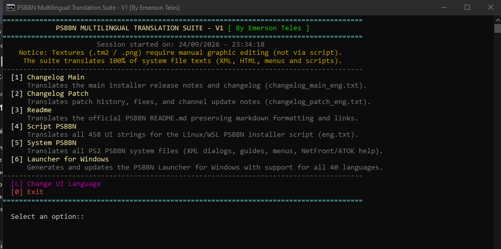

# 🎮 Suíte de Tradução Multilíngue do PSBBN — PSBBN Definitive Project

<div align="center">

**🌐 Idiomas / Languages:**  
[-green?style=for-the-badge)](README-PT-BR.md)
[](README-EN.md)

<br/>

[](https://pt.wikipedia.org/wiki/PlayStation_2)
[](https://github.com/CosmicScale/PSBBN-Definitive-Project)
[](#-matriz-global-de-40-idiomas)
[](https://microsoft.com/powershell)
[](https://github.com/Emertels)
[](https://github.com/CosmicScale)

<br/>



</div>

---

A **Suíte de Tradução Multilíngue do PSBBN** é um conjunto de ferramentas corporativas de localização, tradução e empacotamento automatizado desenvolvido por **Emerson Teles** especificamente para o **PSBBN Definitive Project** do **CosmicScale** (PlayStation Broadband Navigator para PlayStation 2, montado e modificado pelo CosmicScale).

A suíte traduz, formata, verifica e empacota todo o sistema operacional PSBBN, scripts de instalação, inicializadores, históricos de alterações (changelogs) e documentação técnica em **40 idiomas** com zero intervenção manual.

---

## 🔗 Links Oficiais do Projeto Upstream e Rastreamento

* **Repositório Principal do Projeto:** [CosmicScale/PSBBN-Definitive-Project](https://github.com/CosmicScale/PSBBN-Definitive-Project/) — O repositório oficial do PlayStation Broadband Navigator (PSBBN) definitivo e modernizado para PlayStation 2, montado, modificado e mantido por **CosmicScale**, com documentação completa e guias de instalação.
* **Rastreador Oficial de Suporte Multilíngue:** [Issue #299 — Support for multiple languages](https://github.com/CosmicScale/PSBBN-Definitive-Project/issues/299) — Tópico oficial aberto pelo CosmicScale dedicado ao planejamento, acompanhamento e implementação do suporte multilíngue em todo o ecossistema do PSBBN.

---

## 🚀 Principais Recursos e Destaques Arquiteturais

* **Painel Mestre Unificado & 6 Submódulos Autônomos:**
  Execute a suíte completa através do painel interativo central (`PSBBN-Translator.bat` / `PSBBN-Translator.ps1`) ou execute qualquer um dos 6 submódulos especializados de forma independente:
  1. `System PSBBN`: Arquivos centrais do SO do PS2 (diálogos XML, guias do usuário, ajuda HTML do ATOK/NetFront e geração do pacote `bnupdate.tar.gz`).
  2. `Script PSBBN`: Strings da interface do instalador Linux/WSL (`eng.txt`) com aplicação rígida de limites de linha.
  3. `Launcher Windows`: Configuração do inicializador Windows, detecção automática de localidade e tradução dinâmica em tempo real para novas linhas.
  4. `Changelog Main`: Notas de lançamento oficiais do instalador e changelog mestre.
  5. `Changelog Patch`: Histórico de atualizações de canais e logs de patch.
  6. `Readme`: Tradução da documentação técnica com blindagem de tokens markdown, isolamento absoluto de blocos de código e sincronização de âncoras.

* **Download Automático da Versão Oficial Mais Recente (Zero Arquivos Desatualizados):**
  * Antes de traduzir, cada módulo consulta automaticamente os repositórios oficiais no GitHub (`CosmicScale/PSBBN-Definitive-Project` / `CosmicScale/PSBBN-Definitive-English-Patch`) e baixa a versão mais recente dos arquivos fonte (`README.md`, `PSBBN-Launcher-For-Windows.ps1`, `eng.txt`, etc.).
  * Exibe status informativo `[i] Baixando a versão oficial mais recente do GitHub...` e substitui o arquivo local.
  * Em caso de falha de conexão com a internet ou GitHub, utiliza o arquivo local existente como fallback seguro.

* **Limpeza Automática de Cache Temporário com Preservação de Dicionário:**
  * Ao finalizar a tradução de qualquer módulo, os arquivos de cache de trabalho temporário (`cache_*.json`) são excluídos automaticamente, liberando espaço e evitando resíduos desatualizados.
  * O arquivo `Launcher_Windows/data/launcher_text_40langs.json` é preservado de forma estrita e segura como o banco de dados mestre de traduções do inicializador (realocado para `data/` para separar dados permanentes de caches temporários).

* **Geração Limpa de Arquivo Único e Separação Estrita dos Portugueses (PT-BR vs PT-PT):**
  * Ao traduzir para Português (Brasil), gera exclusivamente `README-PT-BR.md` (eliminada a criação duplicada do arquivo `README-POR.md`).
  * Ao traduzir para Português (Portugal), gera exclusivamente `README-PT-PT.md` (eliminada a criação do arquivo `README-PTT.md`).
  * Aplica regras de localização específicas para o Português de Portugal (`ficheiros` em vez de `arquivos`, `aplicações` em vez de `aplicativos`, `ecrã` em vez de `tela`).
  * A barra de navegação Markdown diferencia com precisão os links de ambos os dialetos.
  * Cada execução gera estritamente 1 único arquivo por idioma sem arquivos duplicados.

* **Exibição Seletiva das Opções de Exclusão da Pasta Input ([X] / [V]):**
  * As opções de gerenciamento de arquivos (`[X] Excluir arquivo da pasta input | [V] Manter arquivo da pasta input`) são exibidas estritamente quando arquivos foram baixados e traduzidos.
  * Ao trocar o idioma da interface (`[L]`), as opções de exclusão são ocultadas, exibindo apenas as teclas limpas de navegação (`[Enter] Menu Principal | [B] Tela Anterior | [Esc] Sair`).

* **Layout Centralizado no Terminal e Aviso de Texturas em 2 Linhas Limpas:**
  * O horário de início da sessão (`Sessão iniciada em: ...`) fica centralizado logo abaixo do cabeçalho principal da suíte.
  * O aviso de texturas (`TextureDisclaimer`) é formatado dinamicamente em 2 frases balanceadas ($\le 84$ caracteres por linha) e centralizado, evitando estouro de tela e quebras no meio de palavras ou números como `100%`.

* **Confirmação Nativa de Idioma em Todos os 40 Idiomas:**
  * Dicionário completo de 40 idiomas para `LangAppliedSuccess`, confirmando a alteração de idioma nativamente em todos os 40 idiomas (ex.: Polonês, Tcheco, Russo, Francês, Alemão, Japonês, etc.).

* **Blindagem Resiliente de Links e Código Markdown (Tradução do README):**
  * Substituiu tokens vulneráveis (`XYZMDURL_0_XYZ`) por URLs dummy compatíveis com o padrão RFC (`https://u{n}.link`) e isolamento com `<code>...</code>`.
  * Os modelos neurais do Google Translate interpretam essas URLs como endereços web válidos, preservando pontuações, colchetes e parênteses sem adulterações.
  * Algoritmo de restauração multi-pass garante 100% de integridade com 0 resíduos de tokens nos arquivos finais.

* **Expansão Dinâmica em Tempo Real (PSBBN Launcher for Windows):**
  * Baixa o script oficial mais recente diretamente das releases do GitHub.
  * Analisa dinamicamente todas as chaves oficiais de `eng = @{ ... }` sem depender de limites estáticos ou índices rígidos.
  * Se o CosmicScale adicionar novas chaves (`prompt_22`, `warn_10`, `error_13`, etc.), a suíte as traduz automaticamente em tempo real via Google Translate API com 3 camadas de redundância.
  * Aplica formatação rigorosa de linha única via `Format-LauncherString` (removendo `\r\n` e espaços excedentes para garantir 0 quebras de linha).
  * Salva automaticamente as novas traduções no cache `launcher_text_40langs.json` e gera blocos individuais de exportação em `output/individual/<idioma>.txt`.

* **Isolamento Absoluto de Blocos de Código (Tradução do README):**
  * Rastreia o estado `$inCodeFence` através de cercas de código markdown (` ``` ` e `~~~`).
  * Todos os comandos de terminal, scripts bash e caminhos de diretório (`cd PSBBN-Definitive-Project`, `sudo apt install git`, `./PSBBN-Definitive-Patch.sh`) permanecem 100% intactos em inglês puro, prevenindo falhas de execução como `cd PSBBN-Depinitibo-Proyekto`.

* **Contextualização de Cabeçalhos e Imunidade a Falsos Cognatos:**
  * Protege `Main Menu` contra falsas detecções pelo motor de tradução (evitando confusão com o termo malaio "main" que significa "jogar").
  * Garante localização contextual impecável em todos os 40 idiomas:
    * Filipino/Tagalo: `## Pangunahing Menu` (nunca `## Play Menu`), `# Pagpapakita ng Video ng PSBBN`
    * Português (BR e PT): `## Menu Principal`, `# Demonstração em Vídeo do PSBBN`
    * Espanhol: `## Menú Principal`, `# Demostración en Video de PSBBN`
    * Francês: `## Menu Principal`
    * Alemão: `## Hauptmenü`
    * Russo: `## Главное меню`

* **Padronização Rigorosa do Português (PT-BR / PT-PT):**
  * Elimina por completo o jargão burocrático "habilitar / desabilitar" em todos os módulos, strings e caches.
  * Padronizado estritamente para "ativar / desativar" ("ative", "desative", "ativado", "desativado", "ativando", "desativando").

* **100% de Localização da Interface de Terminal nos 40 Idiomas:**
  * Sem vazamento de idioma embutido: ao executar em inglês (ou qualquer outro idioma), 100% dos banners, prompts interativos, barras de progresso, logs e mensagens de erro são renderizados no idioma ativo.
  * Seletor dinâmico de idiomas em tempo real (`[L] Trocar Idioma`) acessível a qualquer momento durante a navegação.

* **Compatibilidade Nativa com Hardware do PlayStation 2:**
  * **Arquitetura de Codificação Dupla:** Garante que todos os arquivos XML/HTML do PS2 sejam gravados em UTF-8 **sem BOM** (evitando travamentos no analisador XML do Emotion Engine), enquanto scripts PowerShell utilizam UTF-8 **com BOM** (evitando corrupção de páginas de código ANSI no Windows).
  * **Injeção de Permissão Binária POSIX 0755:** Injeta permissões executáveis POSIX (`-rwxr-xr-x`) no `bnupdate.tar.gz` para `./opt0/bn/bin/bn` via manipulação direta de cabeçalhos tar em nível de bytes no PowerShell no Windows, resolvendo `Permission Denied (errno 13)` sem necessidade de WSL ou utilitários Linux.

* **Reconstrução Inteligente de Guias do Usuário (`opt0/bn/script/guide`):**
  Concatena tags `<LINE>` fragmentadas em sentenças contínuas antes da tradução, reformatando pós-tradução com margens balanceadas ($\le 52$ caracteres), recuo suspenso de 2 espaços, dimensionamento dinâmico de `<TEXTAREA>` (`visible` e `scrollbar`), e zero palavras órfãs no final de linhas.

* **Reparo Cirúrgico de XML:**
  Corrige aspas duplas inválidas em `error.xml:13` sem danificar ou remover atributos XML legítimos (`subgroup="info_item"`).

* **Glossário Gamer Profundo para 40 Idiomas:**
  Protege marcas da comunidade PS2 (`Open PS2 Loader`, `APA-Jail`, `Save Application System`, `In-Game Reset`, `Virtual Memory Cards`, `VMC Groups`, `Game and App Installer`) e controles de hardware (`MAIN POWER`, `ON/STANDBY/RESET`) contra traduções literais absurdas em Tagalo, Árabe, Russo, Japonês, etc.

* **Ajuste de Linha de Script ($\le 104$ caracteres):**
  Algoritmo de 4 camadas de abreviação e recorte inteligente que garante que todas as 458 strings da interface de instalação caibam perfeitamente dentro das caixas de diálogo do Linux/WSL.

* **Sintaxe Impecável e Código Limpo:**
  100% dos scripts alcançam **0 erros no analisador sintático AST** verificado pelo compilador PowerShell, com base de código otimizada (~350 KB para o script mestre).

---

## 🌐 Matriz Global de 40 Idiomas

| # | ISO | Idioma | Nome Nativo | Pasta | # | ISO | Idioma | Nome Nativo | Pasta |
|:-:|:---:|:-------|:------------|:------|:-:|:---:|:-------|:------------|:------|
| 01 | `ar` | Árabe | العربية | `Arabic` | 21 | `ko` | Coreano | 한국어 | `Korean` |
| 02 | `bn` | Bengali | বাংলা | `Bengali` | 22 | `ms` | Malaio | Bahasa Melayu | `Malay` |
| 03 | `bg` | Búlgaro | Български | `Bulgarian` | 23 | `mr` | Maratona | मराठी | `Marathi` |
| 04 | `zh-cn` | Chinês (Simp.) | 简体中文 | `Chinese (Simplified)` | 24 | `no` | Norueguês | Norsk | `Norwegian` |
| 05 | `zh-tw` | Chinês (Trad.) | 繁體中文 | `Chinese (Traditional)` | 25 | `fa` | Persa | فارسی | `Persian` |
| 06 | `hr` | Croata | Hrvatski | `Croatian` | 26 | `pl` | Polonês | Polski | `Polish` |
| 07 | `cs` | Tcheco | Čeština | `Czech` | 27 | `pt` | Português (BR) | Português (Brasil) | `Portuguese (Brazil)` |
| 08 | `da` | Dinamarquês | Dansk | `Danish` | 28 | `pt-pt` | Português (PT) | Português (Portugal) | `Portuguese (Portugal)` |
| 09 | `nl` | Holandês | Nederlands | `Dutch` | 29 | `ro` | Romeno | Română | `Romanian` |
| 10 | `tl` | Filipino | Tagalog | `Filipino` | 30 | `ru` | Russo | Русский | `Russian` |
| 11 | `fi` | Finlandês | Suomi | `Finnish` | 31 | `sr` | Sérvio | Српски | `Serbian` |
| 12 | `fr` | Francês | Français | `French` | 32 | `sk` | Eslovaco | Slovenčina | `Slovak` |
| 13 | `de` | Alemão | Deutsch | `German` | 33 | `es` | Espanhol | Español | `Spanish` |
| 14 | `el` | Grego | Ελληνικά | `Greek` | 34 | `sv` | Sueco | Svenska | `Swedish` |
| 15 | `iw` | Hebraico | עברית | `Hebrew` | 35 | `ta` | Tâmil | தமிழ் | `Tamil` |
| 16 | `hi` | Hindi | हिन्दी | `Hindi` | 36 | `te` | Telugu | తెలుగు | `Telugu` |
| 17 | `hu` | Húngaro | Magyar | `Hungarian` | 37 | `th` | Tailandês | ไทย | `Thai` |
| 18 | `id` | Indonésio | Bahasa Indonesia | `Indonesian` | 38 | `tr` | Turco | Türkçe | `Turkish` |
| 19 | `it` | Italiano | Italiano | `Italian` | 39 | `uk` | Ucraniano | Українська | `Ukrainian` |
| 20 | `ja` | Japonês | 日本語 | `Japanese` | 40 | `vi` | Vietnamita | Tiếng Việt | `Vietnamese` |

---

## 🛠️ Guia Rápido de Uso

### Método 1: Inicializador Interativo (Recomendado)
Dê um clique duplo em **`PSBBN-Translator.bat`** na raiz do repositório.
* Configura automaticamente a página de código UTF-8 (65001), ativa o modo QuickEdit do console, aplica o bypass de execução e exibe o menu colorido interativo no seu idioma de preferência.

### Método 2: Execução Direta via PowerShell
```powershell
powershell.exe -ExecutionPolicy Bypass -File "PSBBN-Translator.ps1"
```

Para executar submódulos específicos de forma independente:
```powershell
# System PSBBN
powershell.exe -ExecutionPolicy Bypass -File "System PSBBN\Translate-System-PSBBN.ps1"

# Script PSBBN
powershell.exe -ExecutionPolicy Bypass -File "Script PSBBN\Translate-Script-PSBBN.ps1"

# Launcher Windows (Autônomo com suporte dinâmico a novas linhas)
powershell.exe -ExecutionPolicy Bypass -File "Launcher_Windows\Translate-Launcher-Windows.ps1"

# Changelog Main
powershell.exe -ExecutionPolicy Bypass -File "Changelog_Main\Translate-Changelog-Main.ps1"

# Changelog Patch
powershell.exe -ExecutionPolicy Bypass -File "Changelog_Patch\Translate-Changelog-Patch.ps1"

# Readme (com isolamento de código e mapeamento de âncoras)
powershell.exe -ExecutionPolicy Bypass -File "Readme\Translate-README.ps1"
```

---

## 👨‍💻 Créditos e Agradecimentos

* **Emerson Teles** — Desenvolvedor principal, arquiteto da Suíte de Tradução Multilíngue do PSBBN, criador do injetor binário POSIX, dos algoritmos de ajuste de linha para terminal, da auditoria de integridade AST e do pipeline automatizado.
* **CosmicScale** — Fundador, idealizador e mantenedor do **PSBBN Definitive Project**, modder principal do PS2 e autor dos scripts, guias e ecossistema de patches oficiais upstream.

---

## 👤 Sobre o Autor

Desenvolvido e mantido por **Emerson Teles** (conhecido na comunidade como **Emertels**).

Apaixonado por tecnologia, informática, jogos, manutenção de sistemas e tradução/localização de softwares e emuladores para o Português do Brasil (PT-BR).

### 🛠️ Projetos & Contribuições Notáveis:
- **Emulação & Consoles:** Criador e arquiteto da **Suíte de Tradução Multilíngue do PSBBN** para o PS2 (40 idiomas) em colaboração com CosmicScale; localização e suporte a emuladores como **PSBBN** (PlayStation Broadband Navigator do PS2), **PCSX2**, **Dolphin**, **shadPS4**, **Azahar** e **RetroArch**.
- **Softwares & Utilitários:** Tradução 100% de **DSX** (DualSense X - Trusted Translator), **ASUS GPU Tweak III**, **dnGrep**, **XWidget** e ferramentas web (**DualSense Tester**, **DualShock Tools**).
- **Jogos:** Tradução de **Silent Hill 5: Homecoming**, projetos em andamento em **Silent Hill 4: The Room** e diversos outros aplicativos.

---

### 🌐 Conecte-se comigo:

<div align="left">

[](https://github.com/emertels)
[](https://x.com/emertels)
[](https://www.youtube.com/@emersonteles2379)

</div>

